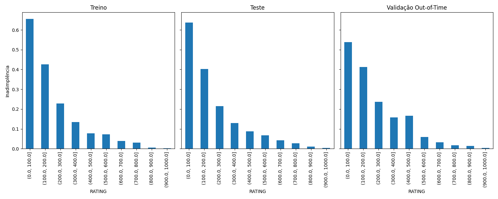

# Credit Risk Analysis Project


**Projeto de Modelagem Preditiva para Inadimplência de Crédito**  
Este repositório contém a solução para um case técnico, focado na construção de um modelo de machine learning para prever a probabilidade de inadimplência de clientes. O projeto utiliza uma estrutura modular com Kedro e técnicas avançadas de feature engineering e interpretabilidade de modelos.

---

## 🚀 Recursos Principais

- **Pipeline Estruturado com Kedro**: Organização modular de dados, processamento e modelos.
- **Modelagem com CatBoost**: Algoritmo de boosting com tratamento nativo de variáveis categóricas.
- **Análise Explicativa com SHAP**: Interpretação do impacto das variáveis no modelo.
- **Sistema de Score (0-1000)**: Conversão da probabilidade em score de risco.
- **10 Faixas de Risco**: Classificação de clientes em categorias de risco para decisão estratégica.
- **Validação Robusta**: Separação temporal (out-of-time) e métricas de avaliação detalhadas.

---

## 📂 Estrutura do Projeto

```plaintext
.
├── conf/           # Configurações do Kedro (catálogo, parâmetros)
├── data/           # Dados em estágios (raw → model_output)
├── notebooks/      # Análises exploratórias e experimentos
├── src/            # Pipelines (processamento, modelagem, scoring)
├── tests/          # Testes unitários
└── requirements.txt
```

### Catálogo de Dados (Kedro)
- **Namespaces**:
  - `modeling`: Dados de desenvolvimento (`base_pagamentos_desenvolvimento.csv`)
  - `scoring`: Dados de teste (`base_pagamentos_teste.csv`)
- **Etapas**:
  - `modeling`: Raw Data → Joined Data → Filtered Data → Cleaned Data → Features Data → Spine → Trained Model
  - `scoring`: Raw Data → Joined Data → Filtered Data → Cleaned Data → Features Data → Model Output

---

## ⚙️ Instalação

1. **Clonar o repositório**:
```bash
git clone https://github.com/seu-usuario/credit-risk-analysis.git
cd credit-risk-analysis
```
2. **Criar ambiente virtual e instalar dependências:**
```bash
python -m venv venv
source venv/bin/activate  # Linux/Mac
pip install -r requirements.txt
```
3. **Executar o pipeline de criação do modelo:**
```bash
kedro run --namespace=modeling
```
4. **Executar o pipeline de consumo do modelo:**
```bash
kedro run --namespace=scoring
```

---

## 🛠️ Como Utilizar

### Pipelines Principais

- **Processamento de Dados**:
```bash
kedro run --pipeline data_processing
```
- **Treinamento do Modelo:**
```bash
kedro run --pipeline data_science
```
- **Escoragem dos Dados de Teste:**
```bash
kedro run --pipeline scoring
```

### Saídas Geradas

- **Modelo Treinado**: `data/06_models/catboost_model.pkl`
- **Previsões finais**: `data/07_model_output/scored_output.parquet`
- **Métricas**: `data/06_models/metrics.csv`
- **Gráficos**: Ordenação dos ratings (`data/06_models/ratings_ordenation.png`) e SHAP summary plot (`data/06_models/shap_summary_plot.png`)

## 📊 Resultados e Métricas

### Desempenho do Modelo

| Métrica       | Treino  | Teste     | Validação Out-of-Time |
|---------------|---------|-----------|-----------------------|
| **AUC-ROC**   | 0.94    | 0.92      | 0.90                  |
| **KS**        | 0.73    | 0.70      | 0.69                  |

### Ordenação da inadimplência nos ratings



### Insights Chave (SHAP)


- **Variáveis mais importantes**:
  1. `CEP_2_DIG` (2 primeiros dígitos do CEP do cliente)
  2. `VALOR_A_PAGAR` (valor do documento a ser pago)
  3. `RENDA_MES_ANTERIOR` (renda do cliente)
